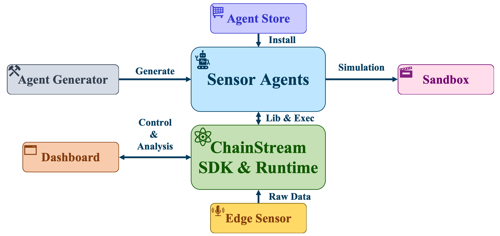

# ChainStream

A Stream-based LLM Agent Framework for Continuous Context Sensing and Sharing

> This work is still work in progress, welcome to following and contribute! Feel free to join our Zulip Group: [mobilellm.zulipchat.com](https://mobilellm.zulipchat.com/#narrow/stream/419866-web-public/topic/ChainStream) if you are interesting in ChainStream :)

## Documentation

The documentation is available at [https://mobilellm.github.io/ChainStream/](https://mobilellm.github.io/ChainStream/).

## Updates

- 2024.06: [ChainStream website](https://mobilellm.github.io/ChainStream/) is launched.
- 2024.06: ChainStream project team participated in Mobisys2024 in Tokyo and presented a report at EdgeFM Workshop. The paper will be published soon.
- 2024.06: [ChainStream Github Repo](https://github.com/MobileLLM/ChainStream) is launched.
- 2024.05: The introduction paper of ChainStream was accepted by [MobiSys 2024, Workshop on Edge and Mobile Foundation Models](https://edgefm.github.io/).
- 2023.12: The project of ChainStream started preliminary development.
- 2023.10: The project of ChainStream was initiated.


## The system overview of ChainStream




## Quick Start

### Install

Clone this repo, change directory to the repo folder, and install with pip:

```bash
pip install -e .
```

### Run

To run the system, simply run the `start.py` script:

```bash
python start.py
```

Then you can access the system at `http://localhost:6677/`. You can browse the agent list, monitor the stream status and so on throught the web interface.

## Build an agent

Building an agent with ChainStream involves following steps.

1. Determine the data-source streams.
2. Define the transformations to transform the stream to the wanted format.
3. Listen to the stream and take actions when needed.

Example:

```python
import chainstream as cs

class PeopleRecognitionAgent(cs.agent.Agent):
    def __init__(self):
        self._source1 = cs.get_stream('glass_camera_video_01')  # instance of Stream
        self._source2 = cs.get_stream('glass_microphone')
        self.known_people = cs.memory.fetch('known_people')['face', 'name']
        self._llm = cs.llm.get_llm('ChatGPT')  # default LLM
        self.video_buffer = cs.context.VideoBuffer(duration=10)
        self.audio_buffer = cs.context.AudioBuffer(duration=10)
        self.talking_to_people = cs.create_stream('talking_to_people')

    def start(self):
        def handle_new_frame(frame):
            self.video_buffer.save(frame)

        def handle_new_audio(audio):
            self.audio_buffer.save(audio)
            prompt = cs.llm.make_prompt([self.video_buffer, self.audio_buffer, 'is there a person talking to the user?'])
            response = self._llm.query(prompt)   # detect whether there is a talking people with LLM
            is_talking = cs.llm.parse_response(response, ['yes', 'no']) == 'yes'
            if is_talking:   # if detected, create a new event to the 'talking_to_people' stream
                self.talking_to_people.add_item({'video': self.video_buffer.snapshot(), 'audio': self.audio_buffer.snapshot()})

        def recognize_person(talking_event):
            video = talking_event['video']
            prompt = cs.llm.make_prompt([self.known_people, video.last_frame(), 'who is the person in the image?'])
            face_name = cs.llm.parse_response(self._llm.query(prompt))
            cs.action.notify_user(self, face_name)  # tell the user who is talking

        self._source1.for_each(self, handle_new_frame)
        self._source2.for_each(self, handle_new_audio)
        self.talking_to_people.for_each(self, recognize_person)

    def pause(self):
        self._source1.pause_listener(self)
        self._source2.pause_listener(self)

    def stop(self):
        self._source1.remove_listener(self)
        self._source2.remove_listener(self)

```


### File structure:

ChainStream
- Agent Generator: natural language to chainstream DSL compiler
- Agent Store: chainstream agent code
- chainstream: chainstream framework code
- ChainStreamClient: Android Edge sensor code
- ChainStreamSandBox: sandbox for agent testing
- ChainStreamTest: test cases for the chainstream framework
- mkdoc：documentation

### Copyright

- ChainStream is designed and developed by the AIoT Team from Institute for AI Industry Research (AIR), Tsinghua University.
- Main contributors: Yuanchun Li, Jiacheng Liu, Wenxing Xu, Liangyan Li, Wenjie Du and others. 
- We will release more detailed references in the future.
