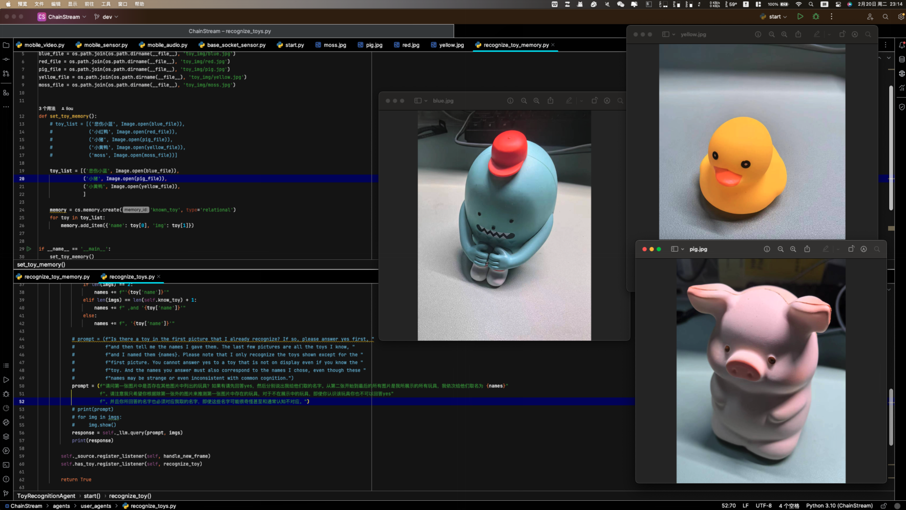
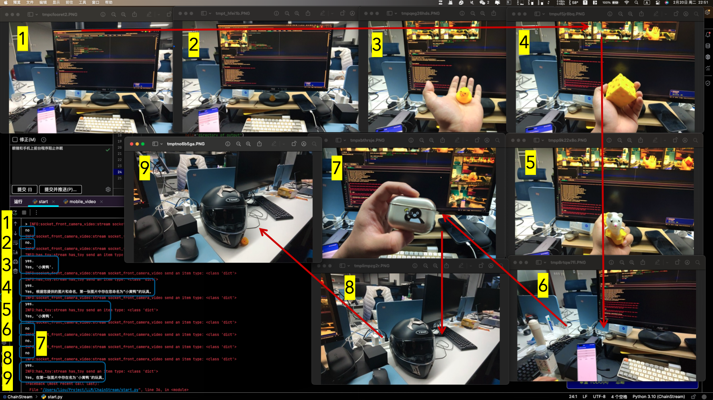

# GLASS CAMERA

我们探索了ChainStream在智能眼镜中的应用。我们尝试给智能眼镜快速部署一个基于ChainStream开发的简单视觉感知Agent。

具体的，我们希望让Glass时刻检查出现在视野范围内的玩具是不是我的玩具。当然玩具在这里指的是任何可以被识别的物体，在实际应用中可以替换为其他物体、人脸等。

## 设计Agent

我们为该任务设计了两步：检测当前视野中是否存在玩具，以及识别出具体的玩具。然后我们基于ChainStream很方便地编写了下面这个Agent：

```python
import chainstream as cs


class ToyRecognitionAgent(cs.agent.Agent):
    is_agent = True

    def __init__(self, agent_id='toy_recognition_agent'):
        super().__init__(agent_id)
        self._source = cs.get_stream('socket_front_camera_video')
        self.know_toy = cs.memory.fetch('known_toy').select_keys(['name', 'img'])
        self._llm = cs.llm.get_model('gpt-4-vision')
        self.video_buffer = cs.context.VideoBuffer(duration=10)

        self.has_toy = cs.create_stream('has_toy')

    def start(self):
        def handle_new_frame(frame):
            self.video_buffer.save(frame['frame'])
            prompt = "Is there a toy in the frame? Simply answer Yes or No"
            img = self.video_buffer.snapshot()
            img.show()
            response = self._llm.query(prompt, img).lower().strip()
            print(response)
            if response.startswith('yes'):
                self.has_toy.send_item({'video_frame': img})

        def recognize_toy(has_toy):
            now_toy_frame = has_toy['video_frame']
            imgs = [now_toy_frame]
            names = ""
            for toy in self.know_toy:
                imgs.append(toy['img'])
                if len(imgs) == 2:
                    names += f"'{toy['name']}'"
                elif len(imgs) == len(self.know_toy) + 1:
                    names += f" ,and '{toy['name']}'"
                else:
                    names += f", '{toy['name']}'"

            prompt = (f"请问第一张图片中是否存在其他图片中列出的玩具？如果有请先回答yes，然后分别说出我给他们取的名字。从第二张开始到最后的所有图片是我所展示的所有玩具，我依次给他们取名为 {names}"
                      f"。请注意我只希望你根据除第一张外的图片来推测第一张图片中存在的玩具，对于不在展示中的玩具，即使你认识该玩具你也不可以回答yes"
                      f"。并且你所回答的名字也必须对应我取的名字，即使这些名字可能很奇怪甚至和通常认知不对应。")

            response = self._llm.query(prompt, imgs)
            print(response)

        self._source.register_listener(self, handle_new_frame)
        self.has_toy.register_listener(self, recognize_toy)

        return True

    def pause(self):
        self._source.unregister_listener(self)

    def stop(self):
        self._source.remove_listener(self)

```

## 加入Memory

随后，我们在该Agent的记忆中放入了下面三个玩具的图片和名称：



## 配置Edge Sensor

我们使用了雷鸟X2智能眼镜，并将ChainStream Client App安装到了智能眼镜上。当App启动时就可以将该设备接入到ChainStream中。


## 运行Agent

我们带上了智能眼镜，并启动了上面编写的Agent，得到了下面的结果：



可以看到Agent能够较为正确的执行我们的任务，虽然正确性上不够好，但本Demo的主要目的是展示ChainStream的便捷性和灵活性，目标检测也并非GPT-4模型所擅长的。

正确性取决于Agent的编写方式，如果想提升本任务的完成效果，可以在Agent中使用专有的检测模型，比如YOLO。
