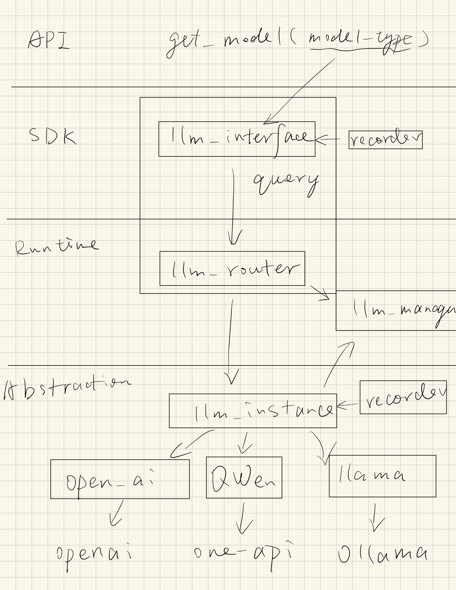

# 运行时优化-LLM

!!! example "笔记介绍"
    本篇笔记记录了设计和修改ChainStream LLM的过程和主要思路。目前尚未完成，主要在[RuntimeOptimize分支](https://github.com/MobileLLM/ChainStream/tree/RuntimeOptimize)，关联到[Issue#86 RuntimeOptimize-已有模型选择和微调新模型](https://github.com/MobileLLM/ChainStream/issues/86)。

## 目标

ChainStream未来将会运行一个体积庞大的Stream flow graph，其单位时间内的计算量和长期开机的累积计算量都是巨大的，会带来大量的token fee开销。目前已有大量不同类型性能的LLM，但对于用户开发者来讲，选用的LLM只需要满足其需求即可，但往往处于性能最大化的考虑选择最强最贵的模型，从而带来能多额外开销。

ChainStream希望从系统角度完成token fee最优化的问题。主要包括两个部分，定制模型和模型选择：

- 定制模型：针对某确定task，在一段数据积累后尝试微调一个定制LLM。
- 模型选择：云端最强模型、云端普通模型、本地模型、定制模型四选一，在开销和效果中找trade off。

此处主要讨论模型选择的设计。

模型选择想要实现的效果主要包括：

- LLM Api仅指定模型类型，如纯文本模型、视觉模型、语音模型等。
- ChainStream Runtime低层支持各型号接口类LLM，包括常见云端和本地LLM。
- 对于不同类型的模型，在时间上监控其运行表现，并根据表现选择最优模型。
- 对于不同型号的模型，在当前时间上对其所有请求进行调度。

## 模型选择

ChainStream自动检测每个task中所使用的LLM表现，自动为其选择更合适的具体型号。而用户仅需指定需要的LLM类型即可。

具体的设计包括以下几个部分：

- API：确定要支持几种LLM类型。
- LLM SDK：
    - get model根据LLM类型返回LLM接口类。 
    - LLM接口类中不执行实际query 
    - 为每个LLM接口类附加recorder
- Runtime：
    - llm manager管理每个llm接口类示例
    - 为每个llm接口类附加一个router，根据节点本身和下游节点的表现情况选择该llm的类型。
- Abstraction Layer：
    - 支持各型号LLM，为每个LLM封装型号实例类
    - 给每个LLM实例类附加recorder，记录运行时性能数据
    - 给每个LLM实例类附加query队列，根据来源agent优先级和流量情况进行调度
- 评测：
    - 使用ChainStream benchmark，针对本文方法做精度和开销的评估。以最强模型做精度上限，以最便宜模型做开销下限。

## 类设计

- API层：
    - get_model(model_type)： 根据模型类别获得LLMInterface类。
- LLM SDK层：
    - LLMInterface类：根据具体类别，通过LLMRouter对接后端LLM实例。
    - LLMInterfaceRecorder类：记录LLM接口类运行情况。
- Runtime层：
    - LLMManager类：管理LLMInstance实例，完成LLMInterface和LLMInstance通过LLMRouter的对接。
    - LLMRouter类：根据节点性能和流量情况，为LLMInterface选择合适的LLMInstance实例。
    - LLMInstance类：封装具体型号的LLM实例，附加LLMRecorder和query队列。
- Config：
    - 定义各型号LLM的配置参数
    - LLMRouter的形式