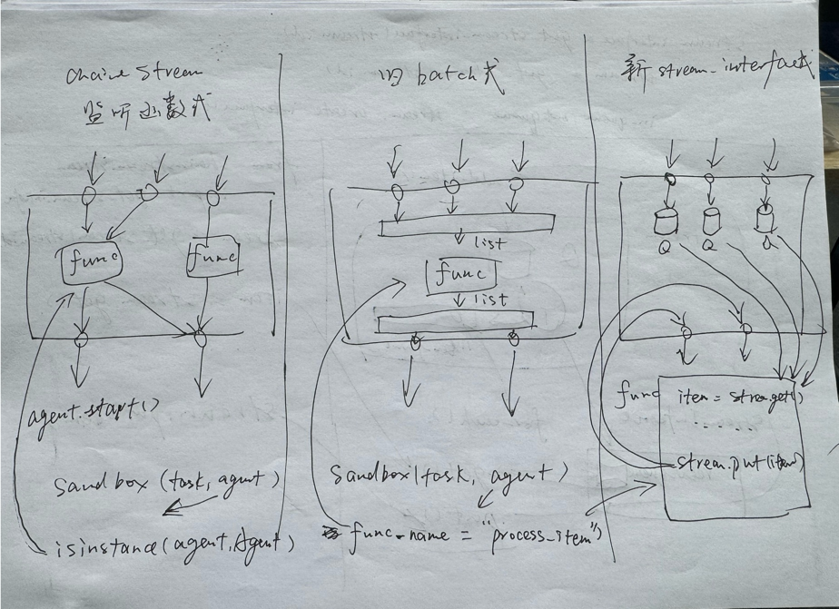

# Quick Start Guide

## 1. What is the NL-Sense Benchmark?

The ChainStream framework is designed to support the development and operation of more powerful agents. Its core is a streaming architecture, which makes debugging and evaluating agent code challenging. To address this, we have designed a sandbox specifically for testing and evaluating agents.

One of the main features of ChainStream is the ability to generate agent code from natural language. We developed an Agent Generator to achieve this NL-to-Code conversion and are currently focused on its performance in perception tasks. However, there is a lack of datasets directly converting NL (Natural Language) to perception tasks, so we created the NL-Sense Benchmark as a dataset for evaluation in this domain.

The NL-Sense Benchmark is an open-source dataset for NL-to-Sense tasks, composed of multiple tasks and a set of evaluation metrics. The evaluation involves constructing an environment in the sandbox that simulates real-world perception scenarios, observing the agent’s behavior in these scenarios, and analyzing its outputs to generate simulation results. Each task represents a specific environment.

Specifically, a task consists of:
- Task description: A natural language description of the task
- Simulation environment: Includes the data, input sequence, timing in the sandbox, and the output to be monitored
- Standard program: Human-written and verified agent code used to assess simulation results

Due to the complexity of perception tasks, it is challenging to manually label each task's standard output. Therefore, the NL-Sense Benchmark evaluates by comparing the similarity between the tested agent's output and the standard agent's output.

## 2. Components of NL-Sense Benchmark

The NL-Sense Benchmark consists of three parts: Tasks, Metrics, and the Sandbox.

### 2.1 Sandbox

ChainStream supports three types of sandboxes, corresponding to the three API types for agents supported by the ChainStream Runtime:



- **ChainStream Listening Function**: This is the primary API for ChainStream agents. It involves inheriting the `chainstream.Agent` class, writing stream transformation functions, and connecting these functions to streams using methods like `stream.for_each`. The completed agent is distributed across various locations, with concurrency managed by the ChainStream Runtime.
- **Batch API**: A batch-based API designed for agents from other frameworks. The sandbox collects all input stream data, converts it into batches, and passes it to the agent. After receiving the agent's output, the results are distributed across output streams. This API does not support concurrency and is not recommended outside of sandbox testing.
- **Stream Interface API**: This API allows agents from other frameworks to interact with ChainStream streams using methods like `stream.get` and `stream.put`. It supports event-driven operations and asynchronous data transmission.

### 2.2 Tasks

As of October 2024, NL-Sense Benchmark contains over 100 tasks covering common perception domains. These tasks are drawn from over 10 different fields and include various modalities of data. We aim to continually expand the number of tasks in the future.

### 2.3 Metrics

Currently, NL-Sense Benchmark evaluates agents based on their success rate and the similarity between the test agent’s output and the standard agent’s output. The similarity is computed using dynamic programming to find the optimal match between result sequences.

Additionally, we have implemented a code similarity evaluation method to measure the resemblance between the generated agent code and the standard answer. Due to code diversity, this metric is only for reference and is not an official evaluation standard.

## 3. Running the NL-Sense Benchmark

### 3.1 Preparation

1. After cloning the ChainStream project, the benchmark is located in the `ChainStreamSandBox` directory.
2. The raw data used in the benchmark is located in the `ChainStreamSandBox/raw_data` directory. Some data is provided in compressed files, which need to be manually extracted.

### 3.2 Starting a Simulation

#### 3.2.1 Single Task

You can simulate an agent with a specific task from the benchmark. You just need to select one of the three sandbox types and provide the agent code and task. As described in section 2.1, we offer three types of sandboxes:

```bash
ChainStreamSandbox
├── __init__.py
├── batch_langchain_sandbox.py    # LangChain environment sandbox for batch mode
├── batch_native_python_sandbox.py  # Python environment sandbox for batch mode
├── stream_interface_sandbox.py    # StreamInterface mode sandbox
├── chainstream_sandbox.py          # ChainStream listening function sandbox
├── results                         # Stores simulation results
│   ├── xxx.json
├── sandbox_base.py                 # Base class
└── utils.py    
```

For example, using the ChainStream listening function sandbox:

```python
if __name__ == "__main__":
    from ChainStreamSandBox.tasks import ALL_TASKS

    Config = ALL_TASKS['HealthTask4']  # Select task

    agent_file = '''  # Write agent code
import chainstream as cs
from chainstream.agent import Agent

class HealthMonitorAgent(Agent):
    def __init__(self, agent_id: str = "health_monitor_agent"):
        super().__init__(agent_id)
        self.all_health_stream = cs.get_stream(self, "all_health")
        self.remind_rest_stream = cs.get_stream(self, "remind_rest")

    def start(self) -> None:
        def process_heart_rate_batch(items):
            print(f"Received {items}")
            for item in items:
                heart_rate = item.get("HeartRate")
                if heart_rate and heart_rate > 75:
                    reminder = {"reminder": f"Heart rate is {heart_rate}! Remember to rest!"}
                    self.remind_rest_stream.add_item(reminder)
                    break  
    
        self.all_health_stream.batch(by_count=1).for_each(process_heart_rate_batch)
    '''
    task_config = Config()
    oj = ChainStreamSandBox(task_config, agent_file, save_result=True, only_init_agent=False)  # Initialize sandbox

    res = oj.start_test_agent(return_report_path=True)  # Start simulation
    print(res)
```

Just modify the script parameters to start agent simulation. The sandbox supports saving simulation results to a specified path, generating a `report.json` file containing configuration, runtime, and output details.

#### 3.2.2 Multiple Tasks

For batch testing multiple tasks, we provide batch testing scripts in the `ChainStreamSandBox/batch_simulation_scripts` directory. Each batch script is a subclass of `SandboxBatchInterface` and generates log files recording multiple report files, supports reruns, and allows resuming from checkpoints.

### 3.3 Results Evaluation

We provide two evaluation methods for final results: success rate and output similarity.

#### 3.3.1 Success Rate

The success rate evaluation script is located in `ChainStreamSandBox/report_evaluator/eval_success_rate.py`. This script accepts a batch simulation log file and automatically calculates the success rate of that simulation.

#### 3.3.2 Output Similarity

Output similarity is more complex. We compare the tested agent's output with the standard agent's output. Each agent's output consists of multiple streams, each containing sequences of items made up of multiple fields.

We designed a sequence comparison method based on dynamic programming to calculate output similarity. For details, refer to the associated paper.

The code is located in `ChainStreamSandBox/report_evaluator/eval_output_similarity.py`. This script accepts a batch simulation log file and automatically calculates output similarity.

## 4. Customization

NL-Sense Benchmark is an open-source project, and you can customize it according to your needs.

Key areas for customization include:
1. Adding raw data: Place the data in the `ChainStreamSandBox/raw_data` directory and write a `DataInterface` class for the new data.
2. Adding tasks: Inherit from the `ChainStreamSandBox/tasks/task_config_base.py` class and register it in `ChainStreamSandBox/tasks/__init__.py`.
3. Adding generators: Inherit from the `AgentGenerator/generator/generator_base.py` class and register it in `AgentGenerator/generator/__init__.py`.
4. Adding sandboxes: Inherit from the `ChainStreamSandBox/sandbox_base.py` class and register it in `ChainStreamSandBox/__init__.py`.
5. Adding batch testing scripts: Inherit from the `ChainStreamSandBox/batch_simulation_scripts/sandbox_interface.py` class and register it in `ChainStreamSandBox/batch_simulation_scripts/__init__.py`.
6. Adding evaluation metrics: Inherit from the `ChainStreamSandBox/report_evaluator/evaluator_base.py` class and register it in `ChainStreamSandBox/report_evaluator/__init__.py`.