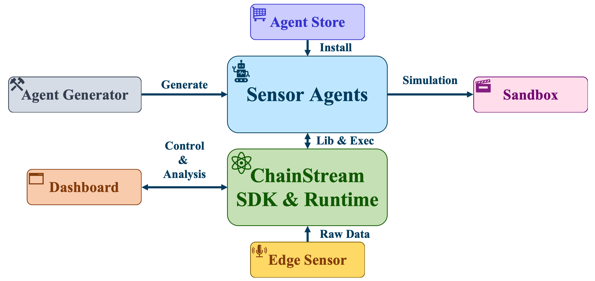

# ChainStream 系统概览

狭义的讲，ChainStream主要是一个LLM Agent开发框架，以其提供的Api和Runtime为主，这部分将在[ChainStream框架架构](../CHAINSTREAM_FRAMEWORK_OVERVIEW/)中详细讨论。广义的讲，ChainStream还包含上图所示的各个组件，主要包括：

- **Sensor Agents**：感知Agent，使用ChainStream SDK开发，并运行在ChainStream Runtime中。
- **ChainStream SDK**：提供Sensor Agents开发所需的Api，包括数据采集、数据处理、数据传输等功能。
- **ChainStream Runtime**：运行Sensor Agents、维护全局流计算图、控制各个边缘设备、维护全局资源等功能。
- **Edge Sensor**：提供面向Android、Linux、Window等系统的App，能够将对应设备上的数据源对接到ChainStream Runtime中。
- **Dashboard**：ChainStream Runtime的控制面板，主要进行对Runtime的可视化、配置、控制、分析等功能。
- **Agent Generator**：ChainStream Agent生成器，能够直接将自然语言描述的Agent转换为代码，并运行在ChainStream Runtime中。
- **Sandbox**：Agent的仿真环境，能够模拟Agent运行的环境，并提供Agent开发、调试、测试等功能。
- **Agent Store**：Agent的仓库，提供Agent的共享、发布、搜索等功能。

