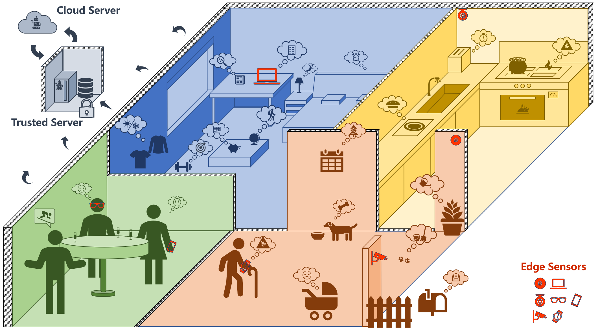

#  ChainStream 应用场景

## 连续感知

我们理想中的Agent感知是打破碎片化的，在时间上连续、在数据范围上连续、在感知过程和结果上连续。

- 时间上连续：Agent的感知是不间断的，时刻都在感知视野内的一切，并将所认为重要的内容记录下来。
- 数据范围上连续：Agent的感知可以跨越多个数据源，ChainStream通过提供Edge Sensor从而打通不同设备、不同传感器、不同数据源的边界。
- 感知过程和结果上连续：不同Agent的感知步骤可以交叉，结果可以复用，打破Agent间的界限。
 
## ChainStream产品形态

ChainStream产品形态主要为多边缘感知设备+本地服务器+云端服务器三级架构：

- 多边缘设备：即Edge Sensor，相当于整个系统的感官和触手，负责向本地服务器传递各传感器数据，并且根据指令执行相应的动作，比如通知、播放声音等。
- 本地服务器：是每个用户部署在本地的受信服务器，负责联通和控制各边缘设备、执行主要的ChainStream计算工作、本地大模型、高隐私数据存储等任务。
- 云端服务器：是由ChainStream云服务提供商提供的补充服务，包括更强力的云端大模型、云端存储、Agent Store等服务。

可以看出，出于隐私和安全的考虑，ChainStream的本地计算和存储的占比较大，故需要用户根据需求配置边缘设备、本地服务器、受信局域网等部分。

## 场景示例

ChainStream面向的用户包括但不限于：

- 个人
- 家庭
- 企业
- 商铺、办公室、学校

每一套ChainStream系统被用户范围内的所有用户、终端、设备所共享。

在我们的设想中，ChainStream可以应用于上图中的场景：

- 个人助理：主要连接个人手机、穿戴设备、智能家具等设备。感知个人用户的日常生活，提供个性化的服务。
- 家庭助理：主要连接家庭成员的手机、智能家具等设备。感知家庭成员的日常生活，提供家庭服务。
- 企业助理：主要连接企业员工的手机、办公设备等设备。感知企业员工的日常工作，提供企业服务。
- 专业场景助理：指如厨房、工作间、实验室、流水线车间等专业化强的场景。感知专业场景的日常工作，充当日志记录、规范检查、流程指导等功能。