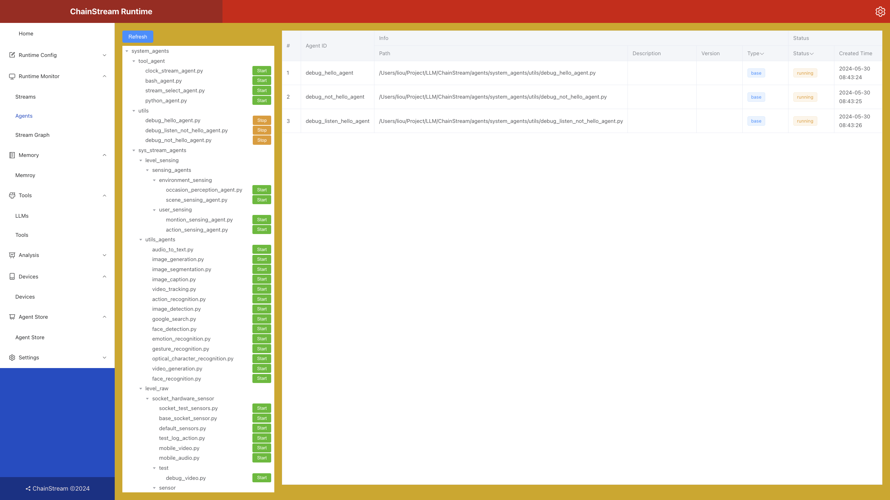
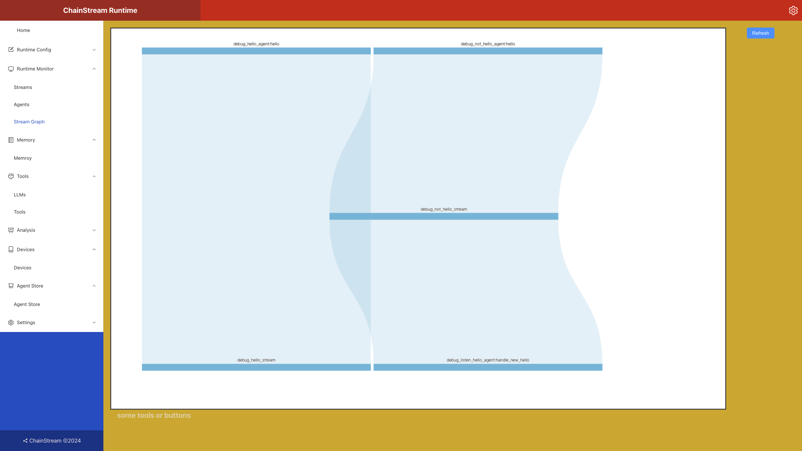

# 控制面板指南

我们提供了Web和shell两种方式来和ChainStream Runtime进行交互，我们更推荐使用Web方式，因为它更加直观并且功能更丰富。

当默认情况下执行`python start.py`命令后，ChainStream Runtime会自动打开Web控制面板，默认地址为`http://localhost:6677`。

目前Web端的控制面板还处于测试阶段，功能还不完整，我们为计划中的功能预留了接口，后续我们会逐步完善。

目前已实现的功能主要是Agent的管理、Stream的监控和Stream Flow Graph的监控。

## 管理Agent

左侧列表中会自动扫描并加载指定路径下的所有Agent，可以对Agent进行启停、重启、删除等操作。

右侧展示了运行中Agent的基本信息，包括Agent ID、Agent名称、Agent类型、Agent状态、Agent创建时间等。

## 监控Stream Flow Graph

图中动态展示系统当前的流计算图，可以直观地看到各个Agent之间拓扑结构和统计信息。
